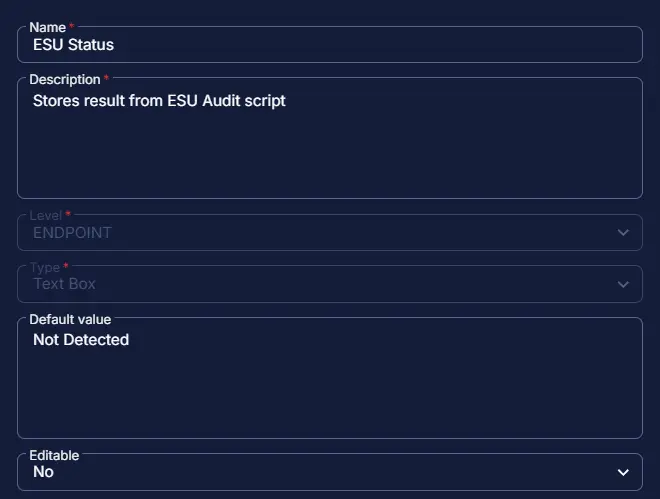

## Summary

Stores the result from the [ESU License Activation Detection](/docs/fad37673-34ab-46e9-8797-b87058f79faa) script.

## Details

| Name       | Level    | Type   | Default  | Editable | Description                                 |
|------------|----------|--------|----------|----------|---------------------------------------------|
| ESU Status | Endpoint | Text Box  |    Not Detected    | No       | Stores the result from the ESU Audit script |

## Dependencies

- [Solution - Windows 10 ESU Licensing and Auditing](/docs/a7e4073e-1f09-4772-aa5e-ee44cf9bf9e7)
- [ESU License Activation Detection](/docs/fad37673-34ab-46e9-8797-b87058f79faa)

## Creation Process

### Step 1

Navigate to `Settings` ➞ `Custom Fields`  

### Step 2

Locate the `Add Field` button on the right-hand side of the screen and click on it.  

## Step 3

The `Add new custom field` dialog box will occur

## Completed Custom Field

