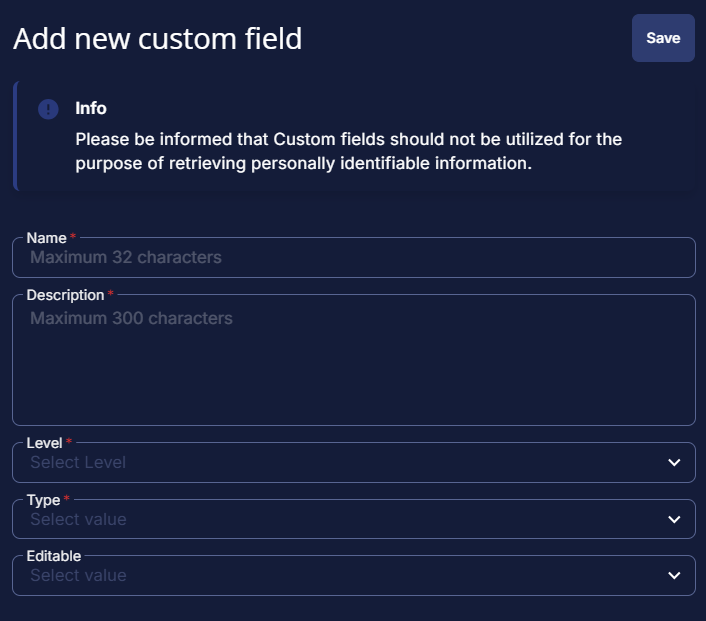

## Summary

Stores the result from the ESU Audit script.

## Details

| Name       | Level    | Type   | Default?  | Required | Editable | Description                                 |
|------------|----------|--------|-----------|----------|----------|---------------------------------------------|
| ESU Status | Endpoint | Text   | blank     | False    | No       | Stores the result from the ESU Audit script |

## Creation Process

### Step 1

Navigate to `Settings` ➞ `Custom Fields`  

### Step 2

Locate the `Add Field` button on the right-hand side of the screen and click on it.  

## Step 3

The `Add new custom field` dialog box will occur

## Completed Custom Field

