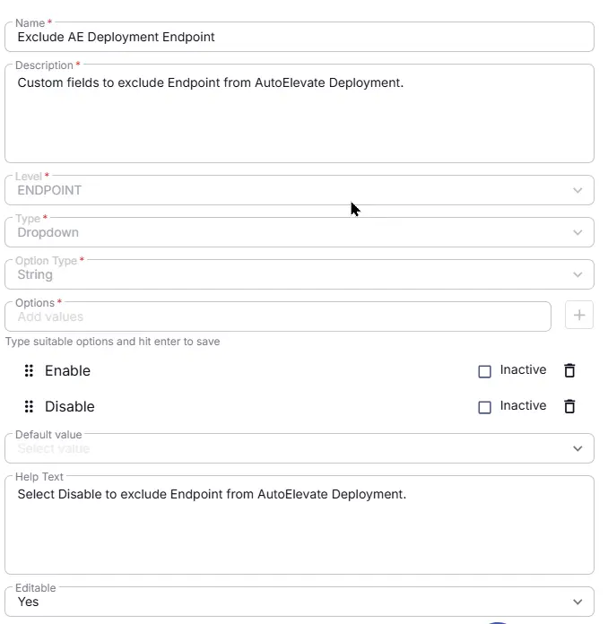

## Summary
Custom Field to exclude Endpoint from AutoElevate Deployment.

## Details

| Name | Description | Level | Type | Option Type | Options | Help Text | Default Value | Editable |
|---|---|---|---|---|---|---|---|---|
| Exclude AE Deployment Endpoint | Custom Field to exclude Endpoint from AutoElevate Deployment. |  Endpoint | Dropdown | String | `Enable`, `Disable` | Select Disable to exclude Endpoint from AutoElevate Deployment. | - | `Yes` |

## Dependencies

- [Solution : AutoElevate Deployment](/docs/4a95cdd5-dec1-4d8e-aa3a-0ee4dd7c0273)

## Completed Custom Field

## Changelog

### 2026-08-10

- Initial version of the document
