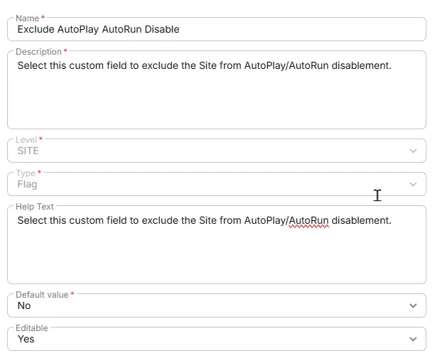
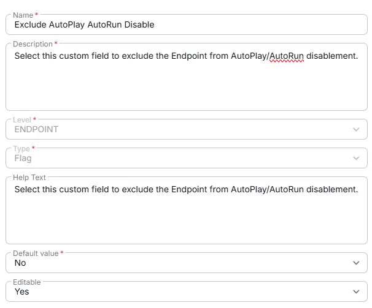

## Summary
Custom field to exclude the Site/Endpoint from AutoPlay/AutoRun disablement. 

## Details

| Name                 | Level                | Type      | Help Text           | Default       | Editable | Description                              |
|----------------------|----------------------|------------- | --------|------------------|----------|------------------------------------------|
| Exclude AutoPlay AutoRun Disable | Site | Checkbox | Select this custom field to exclude the Site from AutoPlay/AutoRun disablement. | No |  Yes  | Select this custom field to exclude the Site from AutoPlay/AutoRun disablement. |
| Exclude AutoPlay AutoRun Disable | Endpoint | Checkbox | Select this custom field to exclude the Endpoint from AutoPlay/AutoRun disablement. | No  |  Yes  | Select this custom field to exclude the Endpoint from AutoPlay/AutoRun disablement. |

## Dependencies

- [Solution - Disable AutoPlay AutoRun policies](/docs/4bfb0532-45a1-41b8-8e69-d552bae1d12d) 

## Completed Custom Field

**Site**  

**Endpoint**  

## Changelog

### 2026-07-01 

- Initial version of the document
