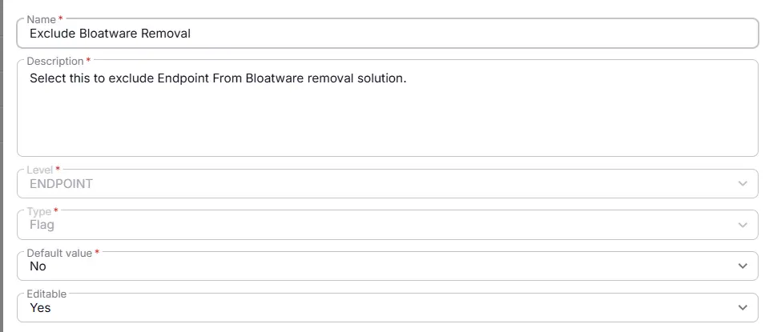
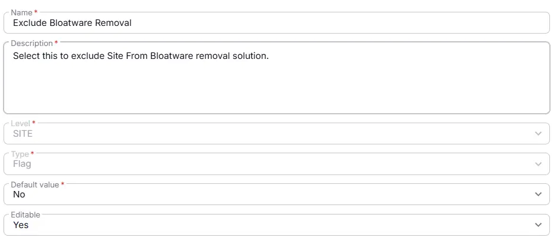

## Summary
Custom Field to exclude Site/Endpoint From Bloatware removal solution.

## Dependencies

- [Solution - Remove Bloatware](/docs/0b1f4077-1cf3-43ea-9c9d-93e2db94e24f)

## Details

| Name                 | Level                | Type                | Default?         | Required | Editable | Description                              |
|----------------------|----------------------|---------------------|------------------|----------|----------|------------------------------------------|
| Exclude Bloatware Removal| Site | Flag | Not Selected | False | Yes   | Select this to exclude Site From Bloatware removal solution.|
| Exclude Bloatware Removal| Endpoint | Flag |  Not Selected |  False | Yes   | Select this to exclude Endpoint From Bloatware removal solution.|

## Completed Custom Field

## Changelog

### 2026-03-30

- Initial version of the document

