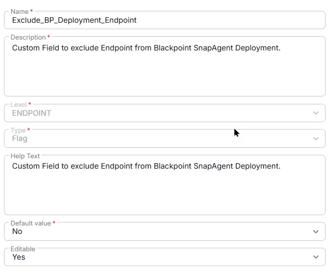

## Summary

Custom Field to exclude Endpoint from Blackpoint SnapAgent Deployment.

## Details

| Name | Description | Level | Type | Option Type | Options | Help Text | Default Value | Editable |
|Exclude_BP_Deployment_Endpoint | Custom Field to exclude Endpoint from Blackpoint SnapAgent Deployment. |  Endpoint | Dropdown | String | `Enable`, `Disable` | Custom Field to exclude Endpoint from Blackpoint SnapAgent Deployment. | - | `Yes` |

## Dependencies

- [Solution - BlackPoint SnapAgent Deployment](/docs/b99808e9-5148-47f6-9da4-bc4eeb590f2a) 

## Completed Custom Field

## Changelog

### 2026-08-18

- Initial version of the document