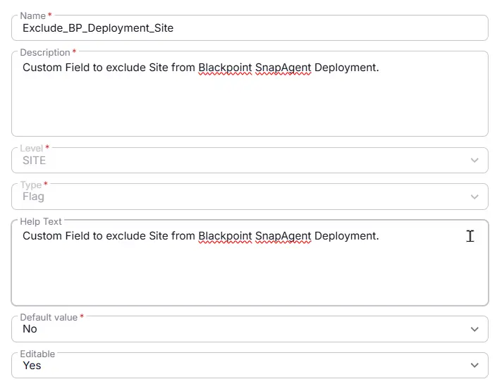

## Summary

Custom Field to exclude Site from BlackPoint SnapAgent Deployment.

## Details

| Name | Description | Level | Type |  Help Text | Default Value | Editable |
|----------|----------|----------|----------|----------|----------|----------|
|Exclude_BP_Deployment_Site | Custom Field to exclude Site from BlackPoint SnapAgent Deployment. |  Site | Flag |Custom Field to exclude Site from BlackPoint SnapAgent Deployment. | - | `Yes` |

## Dependencies

- [Solution - BlackPoint SnapAgent Deployment](/docs/b99808e9-5148-47f6-9da4-bc4eeb590f2a) 

## Completed Custom Field

## Changelog

### 2026-08-25

- Initial version of the document