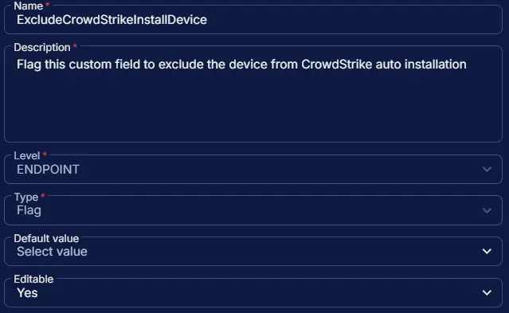

## Summary

Flag this custom field to exclude the device from CrowdStrike auto installation. However, the [Install CrowdStrike Windows Sensor](/docs/7eb5860d-08e2-41cb-b22b-48505618f1ae) task can still be run manually, independent of this field.

## Dependencies

- [DeployCrowdStrikeWindowsSensor](/docs/ffe13fcc-700f-41ea-9fdf-20ea4d253326)
- [Solution: Deploy CrowdStrike Windows Sensor](/docs/dec6391a-c159-4b45-8c3a-9df4d88dd1c5)

## Custom Field Setup Location

**Custom Fields Path:** `SETTINGS` ➞ `Custom Fields`  

## Details

| Name | Level | Type | Default Value | Editable | Description |
| ---- | ----- | ---- | ------------- | -------- | ----------- |
| ExcludeCrowdStrikeInstallDevice | ENDPOINT | Flag | | Yes | Flag this custom field to exclude the device from CrowdStrike auto installation |

## Completed Custom Field

