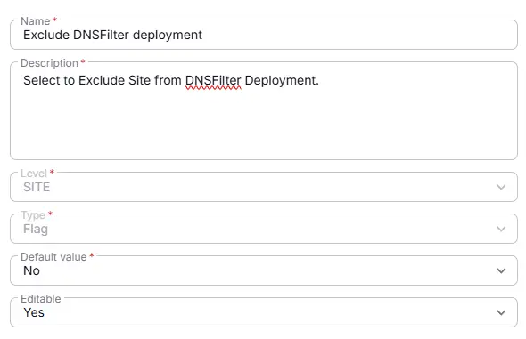
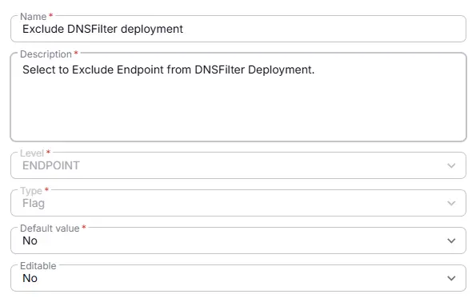

## Summary
Select to exclude Site/Endpoint from DNSFilter Deployment.

## Dependencies

- [Solution - DNS Filter Agent Deployment](/docs/fd6fcda6-9a87-4275-b6eb-1a8f8f63099d)

## Details

| Name                 | Level                | Type                | Default?         | Editable | Description                              |
|----------------------|----------------------|---------------------|------------------|----------|------------------------------------------|
| Exclude DNSFilter deployment | Site | Checkbox| No |  Yes  | Select to Exclude Site from DNSFilter Deployment. |
| Exclude DNSFilter deployment | Endpoint | Checkbox| No |  Yes  | Select to Exclude Site from DNSFilter Deployment. |

## Completed Custom Field

**Site Custom Field:**

**Endpoint Custom Field:**

## Changelog

### 2026-02-18

- Initial version of the document
