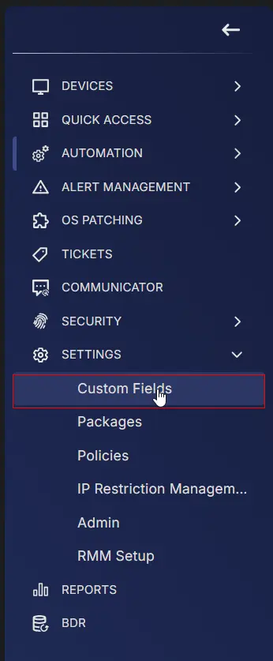
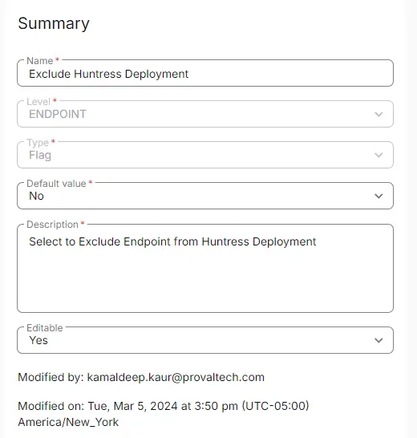

## Summary

Select this custom field to exclude a machine from Huntress Deployment. It is utilized by the [CW RMM - Device Group - Deploy Huntress](/docs/c19dc248-c6a0-4f9c-88c5-b3058245d74a) group.

# Create the Custom Field

**Name:** Exclude Huntress  \
**Type:** Flag  \
**Level:** Endpoint  \
**Description:** Select to Exclude Endpoint from Huntress Deployment  \
**Editable:** Yes 