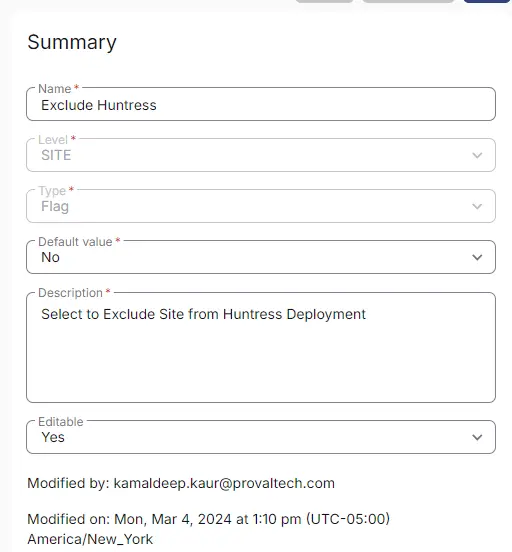

## Summary

Select this custom field to exclude a site from Huntress Deployment. It is being utilized by the '[CW RMM - Device Group - Deploy Huntress](/docs/c19dc248-c6a0-4f9c-88c5-b3058245d74a)' group.

## Create the Custom Field

**Name:** Exclude Huntress  
**Type:** Flag  
**Level:** Site  
**Description:** Select to Exclude Site from Huntress Deployment  
**Editable:** Yes  
