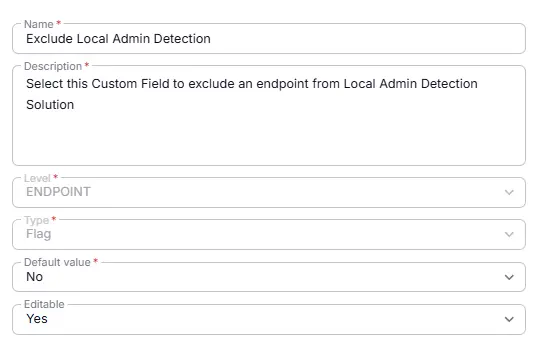

## Summary
Select this custom field to exclude an endpoint from Local Administrator Detection Solution.

## Details

| Name                 | Level                | Type                | Default       |  Editable | Description                              |
|----------------------|----------------------|---------------------|------------------|----------|------------------------------------------|
| Exclude Local Admin Detection | Endpoint | Checkbox | No | Yes   | Select this custom field to exclude an endpoint from Local Administrator Detection Solution.|

## Dependencies

- [Solution - Local Administrator Detection](/docs/7e3f8472-2908-4491-b495-b87bd7ad0fe6) 

## Creation Process

### Step 1

Navigate to `Settings` ➞ `Custom Fields`  

### Step 2

Locate the `Add Field` button on the right-hand side of the screen and click on it.  

## Step 3

The `Add new custom field` dialog box will occur

## Completed Custom Field

## Changelog

### 2026-01-30

- Initial version of the document
