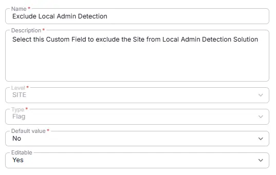

## Summary
Select this Custom Field to exclude the Site from Local Admin Detection Solution.

## Details

| Name                 | Level                | Type                | Default       | Required | Editable | Description                              |
|----------------------|----------------------|---------------------|------------------|----------|----------|------------------------------------------|
| Exclude Local Admin Detection | Site | Checkbox | No | False | Yes   | Select this Custom Field to exclude the Site from Local Admin Detection Solution.|

## Dependencies

- [Solution - Local Administrator Detection](/docs/7e3f8472-2908-4491-b495-b87bd7ad0fe6) 

## Creation Process

### Step 1

Navigate to `Settings` ➞ `Custom Fields`  

### Step 2

Locate the `Add Field` button on the right-hand side of the screen and click on it.  

## Step 3

The `Add new custom field` dialog box will occur

## Completed Custom Field
