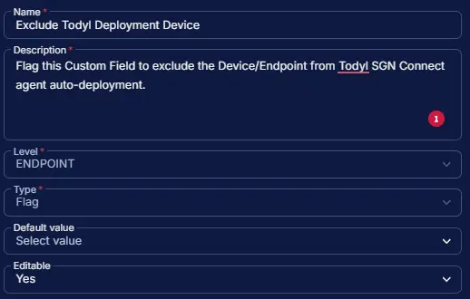

## Summary

Flag this Custom Field to exclude the Device/Endpoint from Todyl SGN Connect agent auto-deployment. However, the [Install Todyl SGN Connect](/docs/c23cdc78-f90e-4aba-b77e-4dff9d612940) task can still be run manually, independent of this field.

## Dependencies

- [Deploy Todyl SGN Connect](/docs/e21d58b1-9fd5-4888-9e1f-788420313237)
- [Solution: Todyl SGN Connect Deployment](/docs/41308550-ea69-4cca-aa0d-9e6f02fcab43)

## Custom Field Setup Location

**Custom Fields Path:** `SETTINGS` ➞ `Custom Fields`  

## Details

| Name | Level | Type | Default Value | Editable | Description |
| ---- | ----- | ---- | ------------- | -------- | ----------- |
| Exclude Todyl Deployment Device | ENDPOINT | Flag | | Yes | Flag this Custom Field to exclude the Device/Endpoint from Todyl SGN Connect agent auto-deployment. |

## Completed Custom Field

