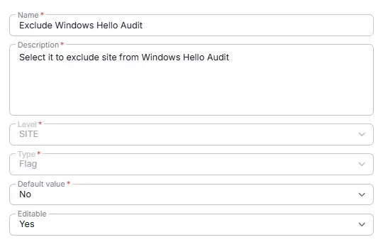
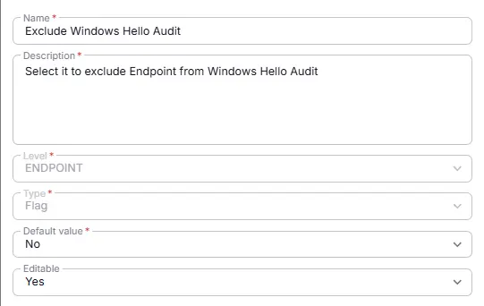

## Summary
Select it to exclude site/Endpoint from Windows Hello Audit

## Details

| Name                 | Level                | Type                | Default?         | Required | Editable | Description                              |
|----------------------|----------------------|---------------------|------------------|----------|----------|------------------------------------------|
| Exclude Windows Hello Audit | Endpoint/Site | Checkbox | No | False | Yes | Select it to exclude site/Endpoint from Windows Hello Audit |

## Dependencies

- [Solution - Windows Hello Audit](/docs/1ec129b5-f607-41ab-b451-b54a2078950c)

## Creation Process

### Step 1

Navigate to `Settings` ➞ `Custom Fields`  

### Step 2

Locate the `Add Field` button on the right-hand side of the screen and click on it.  

## Step 3

The `Add new custom field` dialog box will occur

## Completed Custom Field

`Site Custom Field`  

`Endpoint Custom Field`  
