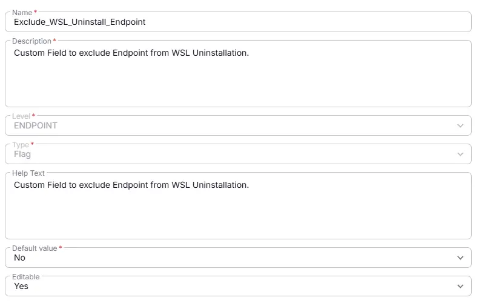

## Summary
Custom Field to exclude Endpoint from WSL Uninstallation.

## Dependencies

- [Solution - CVE-2025-24084 - WSL Uninstall](/docs/cc418b50-c30e-4319-950e-ffa6347dd74e)  

## Details

| Name | Description | Level | Type | Help Text | Default Value | Editable |
|---------------|----------------|--------|------------|------------------|----------|----------|
| Exclude_WSL_Uninstall_Endpoint | Custom Field to exclude Endpoint from WSL Uninstallation. | Endpoint | Flag | Custom Field to exclude Endpoint from WSL Uninstallation. | `No` | `Yes` |

## Completed Custom Field

## Changelog

### 2026-09-16

- Initial version of the document
