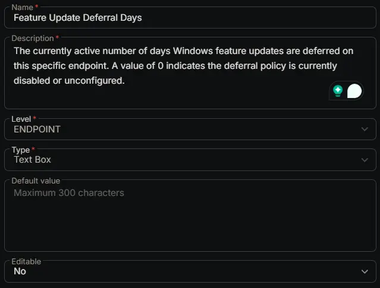

## Summary

The currently active number of days Windows feature updates are deferred on this specific endpoint. A value of 0 indicates the deferral policy is currently disabled or unconfigured.

## Dependencies

- [Solution: Manage Feature Update Deferral](/docs/800f96cd-5e64-48dd-bb9a-f17822db38e8)

## Custom Field Setup Location

**Custom Fields Path:** `SETTINGS` ➞ `Custom Fields`  

## Details

| Name | Level | Type | Options | Default Value | Editable | Description |
| ---- | ----- | ---- | ------- | ------------- | -------- | ----------- |
| Feature Update Deferral Days | ENDPOINT | Text Box | | | No | The currently active number of days Windows feature updates are deferred on this specific endpoint. A value of 0 indicates the deferral policy is currently disabled or unconfigured. |

## Completed Custom Field

## Changelog

### 2026-03-11

- Initial version of the document
