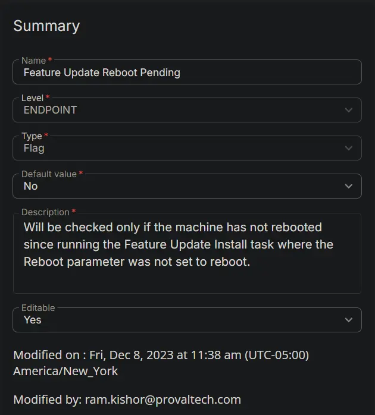

## Summary

The `Feature Update Install With Tracking` script flags a custom field if the installation is successful but the reboot is intentionally suppressed by the user parameter.

## Create the Custom Field

---

**Name:** Feature Update Reboot Pending  
**Type:** Flag  
**Level:** Endpoint  
**Default Value:** No  
**Description:** Will be checked only if the machine has not rebooted since running the Feature Update Install task where the Reboot parameter was not set to reboot.  
**Editable:** Yes  
