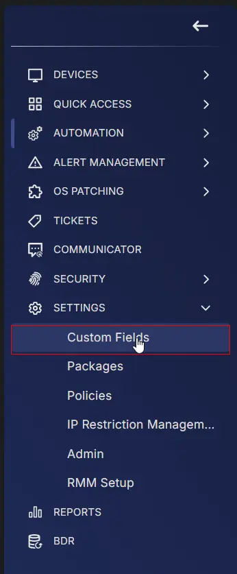

## Summary

This custom field is to be filled with the Huntress Account Key by the partner. It is utilized by the [CW RMM - Device Group - Deploy Huntress](/docs/c19dc248-c6a0-4f9c-88c5-b3058245d74a) task.

# Create the Custom Field

**Name:** Huntress Account Key  
**Type:** Text Box  
**Level:** Company  
**Description:** Huntress Account Key  
**Editable:** Yes  