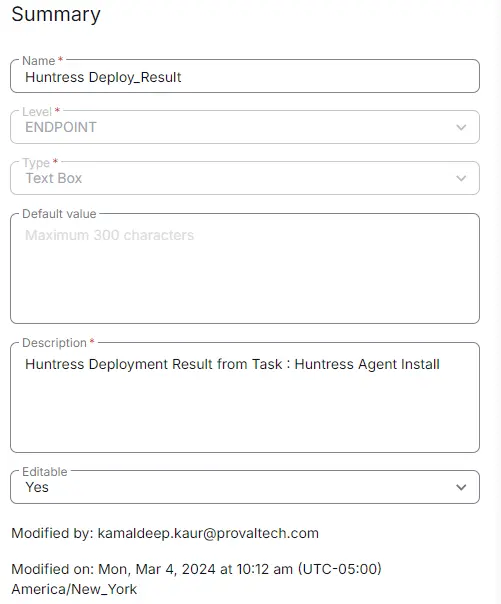

## Summary

The [`CW RMM - Task - Huntress Agent (INSTALL)`](/docs/e1f40d15-13f1-465e-9870-653927ad0434) task utilizes this custom field to store the number of times the task failed to install Huntress on the machine. This can further be utilized to create tickets for Huntress failure as per partners' requirements.

## Create the Custom Field

**Name:** Huntress Deploy_Result  
**Type:** Text Box  
**Level:** Endpoint  
**Description:** Huntress Deployment Result from Task: Huntress Agent Install  
**Editable:** Yes  