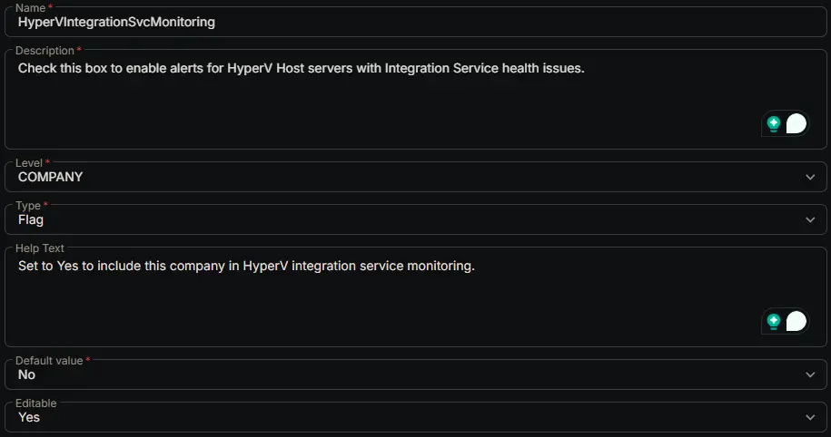

## Summary

Check this box to enable alerts for HyperV Host servers with Integration Service health issues.

## Dependencies

- [Solution: HyperV - Integration Service Monitoring](/docs/08acb7b4-3513-4231-9372-3dbd05e2f43f)

## Custom Field Setup Location

**Custom Fields Path:** `SETTINGS` -> `Custom Fields`

## Details

| Name | Level | Type | Default Value | Editable | Description | Help Text |
| ---- | ----- | ---- | ------------- | -------- | ----------- | --------- |
| HyperVIntegrationSvcMonitoring | COMPANY | Flag | No | Yes | Check this box to enable alerts for HyperV Host servers with Integration Service health issues. | Set to Yes to include this company in HyperV integration service monitoring. |

## Completed Custom Field

## Changelog

### 2026-06-17

- Initial version of the document
