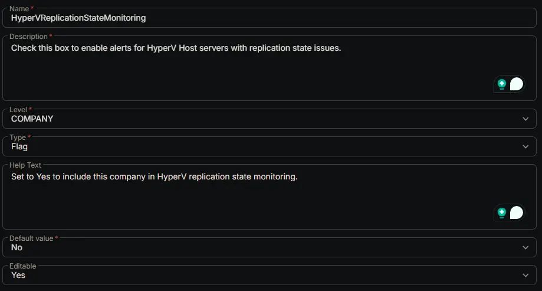

## Summary

Check this box to enable alerts for HyperV Host servers with replication state issues.

## Dependencies

- [Solution: HyperV - Replication State Monitoring](/docs/9f3f0b27-3b3b-4c3e-91b1-6d82d9480f52)

## Custom Field Setup Location

**Custom Fields Path:** `SETTINGS` -> `Custom Fields`

## Details

| Name | Level | Type | Default Value | Editable | Description | Help Text |
| ---- | ----- | ---- | ------------- | -------- | ----------- | --------- |
| HyperVReplicationStateMonitoring | COMPANY | Flag | No | Yes | Check this box to enable alerts for HyperV Host servers with replication state issues. | Set to Yes to include this company in HyperV replication state monitoring. |

## Completed Custom Field

## Changelog

### 2026-06-17

- Initial version of the document
