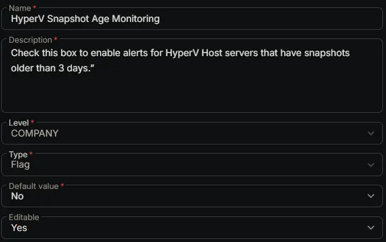

## Summary

Check this box to enable alerts for HyperV Host servers that have snapshots older than 3 days.

## Dependencies

- [Solution: HyperV - Snapshot Age > 3 Days Monitoring](/docs/73e61957-b973-4c64-8c48-70c45f2d400a)

## Custom Field Setup Location

**Custom Fields Path:** `SETTINGS` ➞ `Custom Fields`  

## Details

| Name | Level | Type | Default Value | Editable | Description |
| ---- | ----- | ---- | ------------- | -------- | ----------- |
| HyperV Snapshot Age Monitoring | COMPANY | Flag | No | Yes | Check this box to enable alerts for HyperV Host servers that have snapshots older than 3 days. |

## Completed Custom Field

