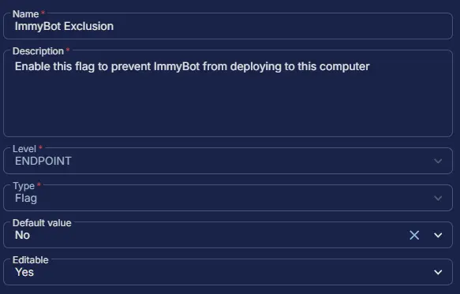

## Summary

Enable this flag to prevent ImmyBot from deploying to this computer. This custom field manages the auto-execution of the task. However, the [Install ImmyBot Agent](/docs/569083f6-86cd-43ee-ae87-54a050c87951) task can still be run manually, independent of this field.

## Dependencies

- [ImmyBot Agent Deployment](/docs/d0a57d05-71c0-495e-a055-803ad7a728ad)

## Custom Field Setup Location

**Custom Fields Path:** `SETTINGS` ➞ `Custom Fields`  

## Details

| Name | Level | Type | Default Value | Editable | Description |
| ---- | ----- | ---- | ------------- | -------- | ----------- |
| ImmyBot Exclusion | ENDPOINT | Flag | No | Yes | Enable this flag to prevent ImmyBot from deploying to this computer |

## Completed Custom Field

