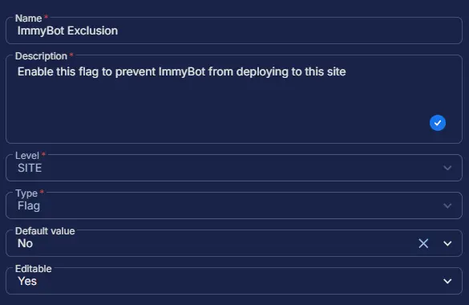

## Summary

Enable this flag to prevent ImmyBot from deploying to this site. This custom field manages the auto-execution of the task. However, the [Install ImmyBot Agent](/docs/c2576ff2-e86f-43f7-94dc-462a7afbc7f1) task can still be run manually, independent of this field.

## Dependencies

- [Solution - ImmyBot Agent Deployment](/docs/d0a57d05-71c0-495e-a055-803ad7a728ad)

## Custom Field Setup Location

**Custom Fields Path:** `SETTINGS` ➞ `Custom Fields`  

## Details

| Name | Level | Type | Default Value | Editable | Description |
| ---- | ----- | ---- | ------------- | -------- | ----------- |
| ImmyBot Exclusion | SITE | Flag | No | Yes | Enable this flag to prevent ImmyBot from deploying to this site |

## Completed Custom Field

