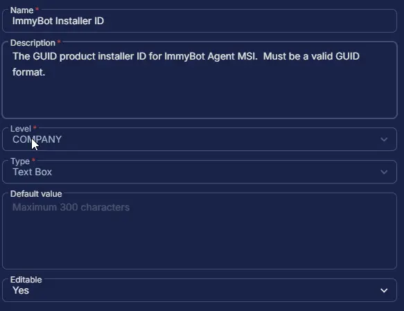

## Summary

The "ImmyBot Installer ID" is a specific identifier used during the installation of the ImmyBot agent. It's a unique string that associates the agent with your ImmyBot tenant and is used for tracking and managing the agent's activity within the platform. You can find it within the installation script generated by ImmyBot for your tenant.

## Dependencies

- [ImmyBot Agent Deployment](/docs/d0a57d05-71c0-495e-a055-803ad7a728ad)

## Custom Field Setup Location

**Custom Fields Path:** `SETTINGS` ➞ `Custom Fields`  

## Details

| Name | Level | Type | Default Value | Editable | Description |
| ---- | ----- | ---- | ------------- | -------- | ----------- |
| ImmyBot Installer ID | COMPANY | Text Box | | Yes | The GUID product installer ID for ImmyBot Agent MSI.  Must be a valid GUID format. |

## Completed Custom Field

