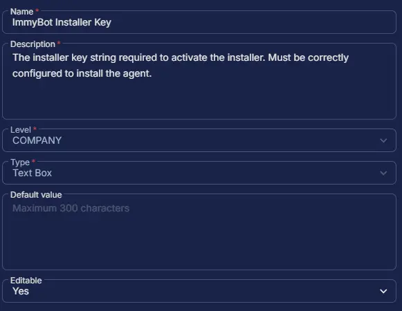

## Summary

This custom field stores the "ImmyBot Installer Key" which is a specific identifier used during the installation of the ImmyBot agent. It's a unique string that associates the agent with your ImmyBot tenant and is used in installing the agent. You can find it within the installation script generated by ImmyBot for your tenant.

## Dependencies

- [Solution - ImmyBot Agent Deployment](/docs/d0a57d05-71c0-495e-a055-803ad7a728ad)

## Custom Field Setup Location

**Custom Fields Path:** `SETTINGS` ➞ `Custom Fields`  

## Details

| Name | Level | Type | Default Value | Editable | Description |
| ---- | ----- | ---- | ------------- | -------- | ----------- |
| ImmyBot Installer Key | COMPANY | Text Box | | Yes |The installer key string required to activate the installer. Must be correctly configured to install the agent. |

## Completed Custom Field

