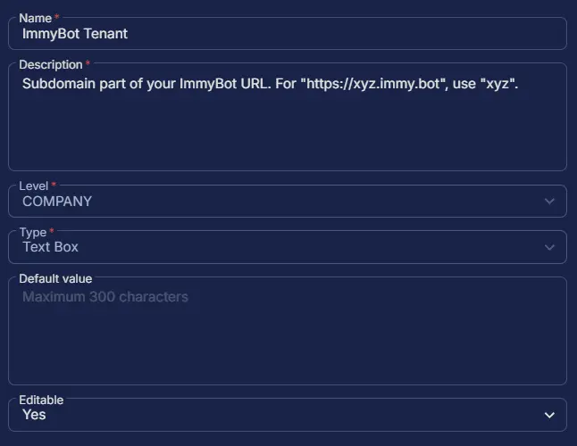

## Summary

Subdomain part of your ImmyBot URL. For "https://xyz.immy.bot", use "xyz".

## Dependencies

- [ImmyBot Agent Deployment](/docs/d0a57d05-71c0-495e-a055-803ad7a728ad)

## Custom Field Setup Location

**Custom Fields Path:** `SETTINGS` ➞ `Custom Fields`  

## Details

| Name | Level | Type | Default Value | Editable | Description |
| ---- | ----- | ---- | ------------- | -------- | ----------- |
| ImmyBot Tenant | COMPANY | Text Box | | Yes | Subdomain part of your ImmyBot URL. For "https://xyz.immy.bot", use "xyz". |

## Completed Custom Field

