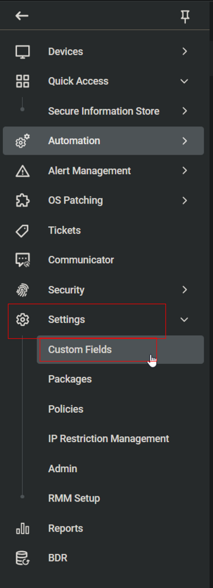
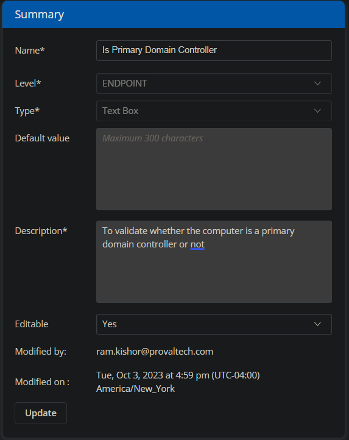
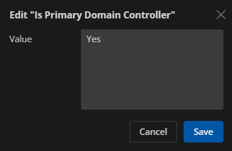

## Summary

This document describes how to validate whether a computer is a primary domain controller. The check is performed by the [CW RMM - Task - Validate Primary Domain Controller](/docs/7bc6ac21-322d-4630-836f-f00e93b94168) task.

The custom field is then used to create the [CW RMM - Machine Group - Infrastructure Master](/docs/c2c2d22b-f735-4ec5-91a6-a014ab2e84a8) group.

## Dependencies

- [CW RMM - Machine Group - Domain Controllers](/docs/eeeb4ee0-d683-44fd-81cf-7f8872b71c68)
- [CW RMM - Task - Validate Primary Domain Controller](/docs/7bc6ac21-322d-4630-836f-f00e93b94168)

## Details

| Field Name                   | Type of Field (Machine or Organization) | Description                                           |
|------------------------------|-----------------------------------------|-------------------------------------------------------|
| Is Primary Domain Controller   | Machine                                 | To validate whether the computer is a primary domain controller or not |

## Screenshot

  
  
**Name:** Is Primary Domain Controller  
**Description:** To validate whether the computer is a primary domain controller or not.

## Sample Value

