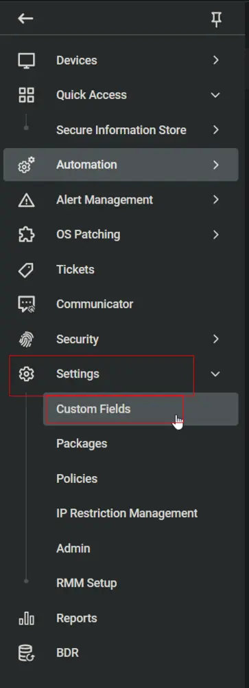
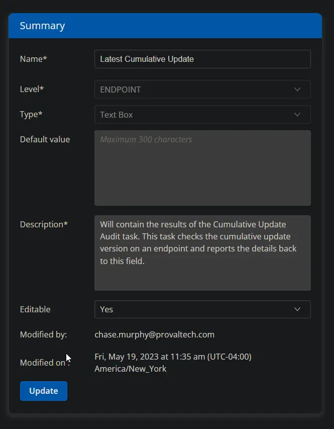
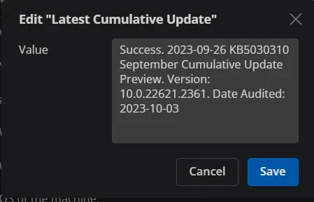

## Summary

This custom field is used to store and display the results of the [CW RMM - Task - Cumulative Update Audit](/docs/defbdc2a-bd40-4baf-9c03-4768e026e0eb) task.

## Dependencies

[CW RMM - Task - Cumulative Update Audit](/docs/defbdc2a-bd40-4baf-9c03-4768e026e0eb)

## Details

| Field Name                | Type of Field (Machine or Organization) | Description                                                                                                                                           |
|---------------------------|-----------------------------------------|-------------------------------------------------------------------------------------------------------------------------------------------------------|
| Latest Cumulative Update   | Machine                                 | Will contain the results of the Cumulative Update Audit task. This task checks the cumulative update version on an endpoint and reports the details back to this field. |

## Screenshot

**Description:** Will contain the results of the Cumulative Update Audit task. This task checks the cumulative update version of an endpoint and reports the details back to this field.

## Sample Value

