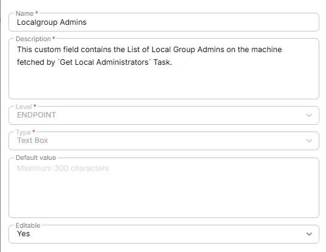

## Summary
This custom field contains the list of Local Admins on Windows machines fetched by [Get Local Administrators](/docs/11f555cc-79ab-464f-87af-b46c324990ee) task.

## Details

| Name                 | Level                | Type                | Default         |  Editable | Description                              |
|----------------------|----------------------|---------------------|------------------|----------|------------------------------------------|
| Local Admins List   | Endpoint | Text Box |   False | Yes  | This custom field contains the list of Local Admins on Windows machines fetched by "Get Local Administrators" task. |

## Dependencies

- [Solution - Local Administrator Detection](/docs/7e3f8472-2908-4491-b495-b87bd7ad0fe6) 
- [Task - Get Local Administrators](/docs/11f555cc-79ab-464f-87af-b46c324990ee) 

## Custom Field Setup Location

**Custom Fields Path:** `SETTINGS` ➞ `Custom Fields`

## Creation Process

### Step 1

Navigate to `Settings` ➞ `Custom Fields`  

### Step 2

Locate the `Add Field` button on the right-hand side of the screen and click on it.  

## Step 3

The `Add new custom field` dialog box will occur

## Completed Custom Field
