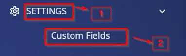
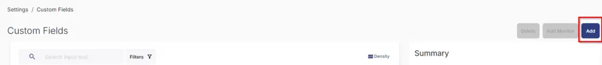
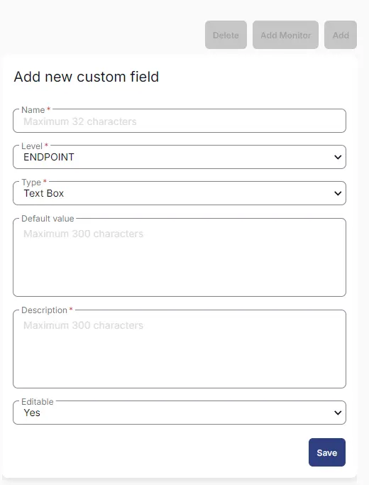
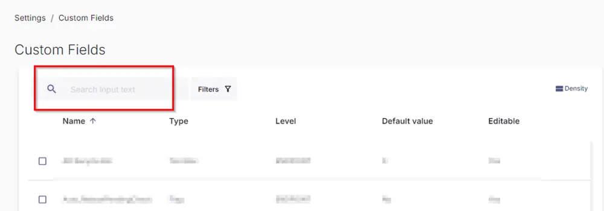

## Summary
The custom fields described here are used in the creation of [Dynamic Group - Devices Opted for Network Adapter Solution](/docs/31025444-7b65-4fa5-9ca3-89d2f5b06a55)  and are utilized in the [Task - Manage - Network Adapter Protocols](/docs/2dbbb9c6-8bb7-4f1a-a050-7cb9f4b2382f)

## Dependencies

- [Dynamic Group - Devices Opted for Network Adapter Solution](/docs/31025444-7b65-4fa5-9ca3-89d2f5b06a55)
- [Task - Manage - Network Adapter Protocols](/docs/2dbbb9c6-8bb7-4f1a-a050-7cb9f4b2382f)
- [ Solution - Manage Network Adapter Solution](/docs/0d47f7f9-c0f9-42f1-9bc9-23b6d5cb6220)

## Details

| Name                          | Level   | Type     | Options                                              | Default | Required | Editable | Description                                         |
|-------------------------------|---------|----------|------------------------------------------------------|---------|----------|----------|-----------------------------------------------------|
| Enable Network Adapter Solution| Company | Checkbox |                                                      |         | True     | Yes      | Check it to enable Network Adapter Solution on the Client |
| Action                        | Company | Dropdown | <ui><li>ENABLE</li><li>DISABLE</li><li>Enable DHCP</li></ui> |         |  False  | Yes      | This is a part of the Network Adapter Solution. Set it to `Enable` to enable a protocol, `Disable` to disable a protocol, `Enable DHCP` to configure a protocol to use DHCP.|
| Action                        | Site | Dropdown | <ui><li>ENABLE</li><li>DISABLE</li><li>Enable DHCP</li><li>Exclude from Solution</li></ui> |         |  False  | Yes      | This is a part of the Network Adapter Solution. Set it to `Enable` to enable a protocol, `Disable` to disable a protocol, `Enable DHCP` to configure a protocol to use DHCP.|
| Action                        | Endpoint | Dropdown | <ui><li>ENABLE</li><li>DISABLE</li><li>Enable DHCP</li><li>Exclude from Solution</li></ui> |         |  True  | False  | This is a part of the Network Adapter Solution. Set it to `Enable` to enable a protocol, `Disable` to disable a protocol, `Enable DHCP` to configure a protocol to use DHCP.|
| Protocol                      | Company | Dropdown | <ui><li>IPv4</li><li>IPv6</li><li>Both</li></ui>  |         | False  | Yes      | This is a part of Network Adapter Solution. Select `IPv4` to perform the above action on IPv4, `IPv6` to perform the above action on IPv6, `Both` to perform action on both IPv4 and IPv6. `Both` option is not supported with the `Disable` action, as both protocols cannot be disabled simultaneously.|
| Protocol                      | Site | Dropdown | <ui><li>IPv4</li><li>IPv6</li><li>Both</li></ui>  |         | False | Yes      | This is a part of Network Adapter Solution. Select `IPv4` to perform the above action on IPv4, `IPv6` to perform the above action on IPv6, `Both` to perform action on both IPv4 and IPv6. `Both` option is not supported with the `Disable` action, as both protocols cannot be disabled simultaneously.|
| Protocol                      | Endpoint | Dropdown | <ui><li>IPv4</li><li>IPv6</li><li>Both</li></ui>  |         |  False | Yes      | This is a part of Network Adapter Solution. Select `IPv4` to perform the above action on IPv4, `IPv6` to perform the above action on IPv6, Both to perform action on both IPv4 and IPv6. `Both` option is not supported with the `Disable` action, as both protocols cannot be disabled simultaneously.|

## Implementation

1. Navigate to **Settings** -> **Custom Fields**:  
   

2. Click on the **Add** button once the `Custom Fields` page is opened.  
   

3. After clicking **Add**, you will see the fields below to be filled:  
   

4. Enter the values provided above one by one and save the custom fields.  
   Once the custom fields are created, please validate them by searching for them in the search input text field provided in the custom fields:  
     
   It will show you the custom fields you created.