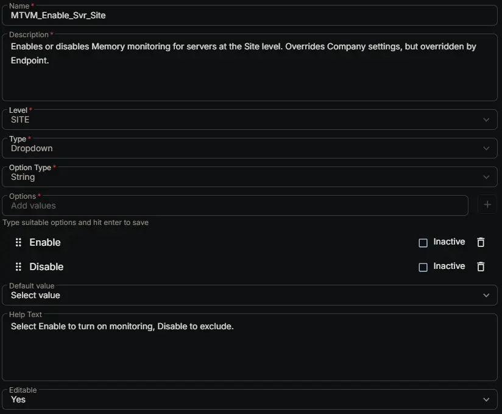

## Summary

Enables or disables Memory monitoring for servers at the Site level. Overrides Company settings, but overridden by Endpoint.

## Dependencies

- [Solution: Memory Threshold Violation Monitoring](/docs/cda6ee21-e70f-45c3-868c-1800d4aa26d7)

## Custom Field Setup Location

**Custom Fields Path:** SETTINGS ➞ Custom Fields

## Details

| Name | Description | Level | Type | Option Type | Options | Help Text | Default Value | Editable |
|---|---|---|---|---|---|---|---|---|
| MTVM_Enable_Svr_Site | Enables or disables Memory monitoring for servers at the Site level. Overrides Company settings, but overridden by Endpoint. | `Site` | `Dropdown` | `string` | `Enable`, `Disable` | Select Enable to turn on monitoring, Disable to exclude. |  | `Yes` |

## Completed Custom Field

## Changelog

### 2026-07-15

- Initial version of the document
