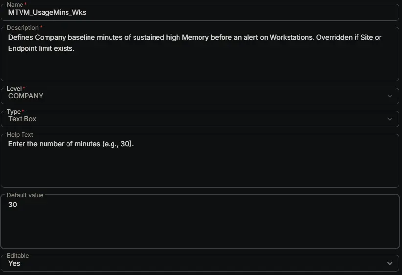

## Summary

Defines Company baseline minutes of sustained high Memory before an alert on Workstations. Overridden if Site or Endpoint limit exists.

## Dependencies

- [Solution: Memory Threshold Violation Monitoring](/docs/cda6ee21-e70f-45c3-868c-1800d4aa26d7)

## Custom Field Setup Location

**Custom Fields Path:** SETTINGS ➞ Custom Fields

## Details

| Name | Description | Level | Type | Help Text | Default Value | Editable |
|---|---|---|---|---|---|---|
| MTVM_UsageMins_Wks | Defines Company baseline minutes of sustained high Memory before an alert on Workstations. Overridden if Site or Endpoint limit exists. | `Company` | `Text Box` | Enter the number of minutes (e.g., 30). | `30` | `Yes` |

## Completed Custom Field

## Changelog

### 2026-07-15

- Initial version of the document
