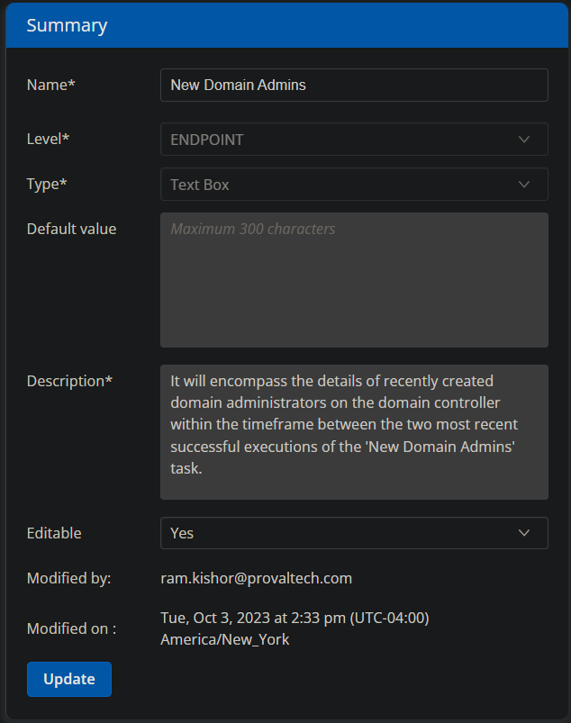
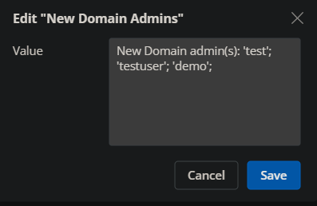

## Summary

This custom field is used to store and display the results of the [CW RMM - Task - New Domain Admins](/docs/a96db8f9-87fc-4e02-a1b3-2ed60913fc82) task.

## Dependencies

[CW RMM - Task - New Domain Admins](/docs/a96db8f9-87fc-4e02-a1b3-2ed60913fc82)

## Details

| Field Name        | Type of Field (Machine or Organization) | Description                                                                                                                                                                                                                      |
|-------------------|-----------------------------------------|----------------------------------------------------------------------------------------------------------------------------------------------------------------------------------------------------------------------------------|
| New Domain Admins | Machine                                 | This field encompasses the details of recently created domain administrators on the domain controller within the timeframe between the two most recent successful executions of the '[CW RMM - Task - New Domain Admins](/docs/a96db8f9-87fc-4e02-a1b3-2ed60913fc82)' task. |

## Screenshot

  
  
**Description:** This field encompasses the details of recently created domain administrators on the domain controller within the timeframe between the two most recent successful executions of the 'New Domain Admins' task.

## Sample Value

  
  
  

