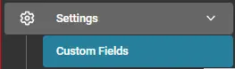
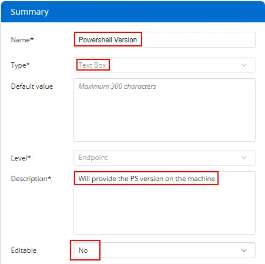

## Summary

This custom field is used to store Windows PowerShell version information about the endpoint. These details are gathered by the [CW RMM - PowerShell Version Information](/docs/a8419e91-9e07-4f16-be4b-769c78f86f1b) task.

# Create the Custom Field

- **Name:** PowerShell Version
- **Type:** Text Box
- **Default Value:** NULL / LEAVE EMPTY
- **Level:** Endpoint
- **Description:** Will provide the PS version on the machine
- **Editable:** No
