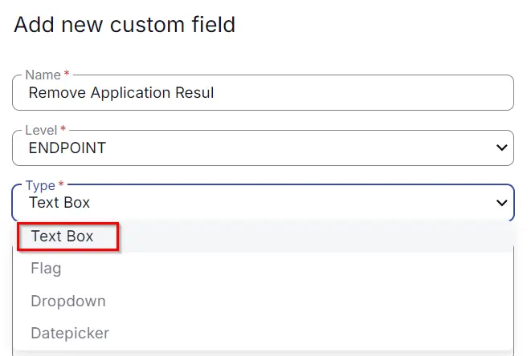

## Summary

The custom field described below is used in the "Remove Application" script to gather the success or failure status.

## Dependencies

## Details

| Name                        | Level    | Type  | Default | Editable | Description                                                                                   |
|-----------------------------|----------|-------|---------|----------|-----------------------------------------------------------------------------------------------|
| Remove Application Result    | Endpoint | Text  |         | No       | It stores either 'Success' or 'Failure'. **Success**: It means the application was removed successfully. **Failure**: It means the application failed to remove. |

## Steps to Create Custom Fields

1. Go to **Settings > Custom Fields**  
   

2. Click the **Add** option  
   

3. Create Custom Field  
   Provide **Name**: Remove Application Result  
   Select **Level**: Endpoint  
     

   Then check the **Type** option:  
   **Type**: Text Box  
     

   Then provide **Default Value** and **Description**:  
   **Default**:  
   **Description**: This stores the Success and Failure results for applications that were removed and those that failed to remove, respectively.  
   **Editable**: No  
     

   **Note**: The description is mandatory to fill out and does not accept **'NEW LINE'**. Write everything in one phrase to describe the details of the custom field.