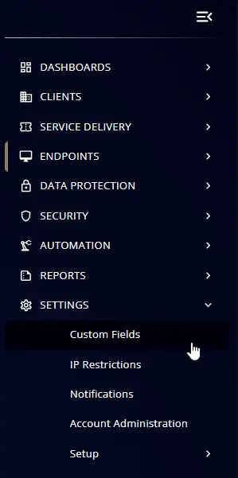
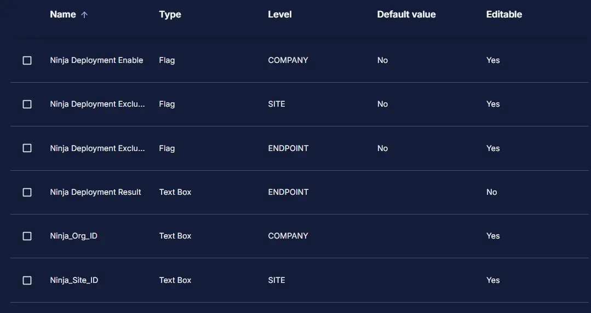

## Summary

This document contains the custom fields that are used in the CW RMM to Ninja migration

## Details

| Name                     | Level   | Type  | Default? | Required | Editable | Description                                                                 |
|--------------------------|---------|-------|----------|----------|----------|-----------------------------------------------------------------------------|
| Ninja Deployment Enable  | Company | Flag  | No       | True     | Yes      | Checking this flag will enable the Ninja Deployment on the company agents.  |
| Ninja Deployment Exclude | Site    | Flag  | No       | False    | Yes      | Checking this flag will exclude the site endpoints from the Ninja Deployment. |
| Ninja Deployment Exclude | Endpoint| Flag  | No       | False    | Yes      | Checking this flag will exclude the endpoint from the Ninja Deployment.     |
| Ninja_Org_ID             | Company | Text  |          | False    | Yes      | This will install the NinjaRMM at the organization level based on the token provided. |
| Ninja_Site_ID            | Site    | Text  |          | False    | Yes      | This will install the NinjaRMM at the site level based on the token provided. |
| Ninja Deployment Result  | Endpoint| Text  |          | False    | No       | This stores the success or failure result of the Ninja Deployment script.   |

## Creation Process

### Step 1

Navigate to `Settings` ➞ `Custom Fields`  

### Step 2

Locate the `Add` button on the right-hand side of the screen and click on it.  

Provide the values as provided in the details section to the custom fields requirement and add them one by one.

## Completed Custom Field

