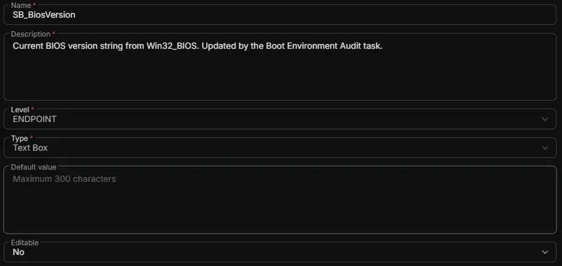

---
id: '061ac707-7f78-40c9-984c-1327793ce6a3'
slug: /061ac707-7f78-40c9-984c-1327793ce6a3
title: 'SB_BiosVersion'
title_meta: 'SB_BiosVersion'
keywords: ['boot', 'secure-boot', 'telemetry', 'secure-boot-certificates', 'kek', 'db', 'dbdefault', 'boot-environment-audit', 'secure-boot-audit']
description: 'Current BIOS version string from Win32_BIOS. Updated by the Boot Environment Audit task.'
tags: ['secureboot', 'certificates', 'security', 'audit', 'windows']
draft: false
unlisted: false
last_update:
  date: 2026-05-14
---

## Summary

Current BIOS version string from Win32_BIOS. Updated by the Boot Environment Audit task.

## Dependencies

- [Solution: Boot Environment Audit](/docs/1cd2e351-ffd3-4afe-966d-0f58c6dc4c49)

## Custom Field Setup Location

**Custom Fields Path:** SETTINGS ➞ Custom Fields

## Details

| Name | Level | Type | Default Value | Editable | Description |
| ---- | ----- | ---- | ------------- | -------- | ----------- |
| SB_BiosVersion | Endpoint | Text Box | | No | Current BIOS version string from Win32_BIOS. Updated by the Boot Environment Audit task. |

## Completed Custom Field

## Changelog

### 2026-05-14

- Initial version of the document

