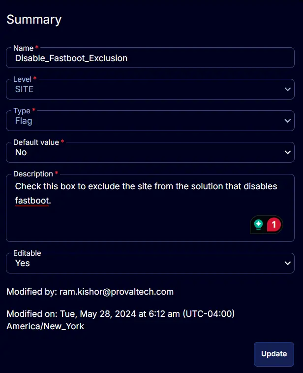

## Summary

Check this box to exclude the site from the solution that disables fastboot.

## Details

| Field Name                     | Level | Type | Default Value | Description                                                             | Editable |
|--------------------------------|-------|------|---------------|-------------------------------------------------------------------------|----------|
| Disable_Fastboot_Exclusion     | SITE  | Flag | No            | Check this box to exclude the site from the solution that disables fastboot. | Yes      |

## Screenshot

  
  
