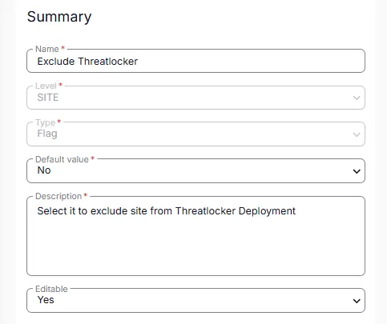

## Summary

Setting this custom field to "Yes" will exclude all the machines under that site from Threatlocker deployment.

## Dependencies

[CW RMM - Solution - Threatlocker Deployment](/docs/c9969bad-d2da-45ec-90fe-d6be82479ebc)

## Details

| Field Name            | Level | Type | Default Value | Description                                                                                     | Editable |
|----------------------|-------|------|---------------|-------------------------------------------------------------------------------------------------|----------|
| Exclude Threatlocker  | Site  | Flag | No            | Setting this custom field to "Yes" will exclude all the machines under that site from Threatlocker deployment. | Yes      |

## Screenshot

