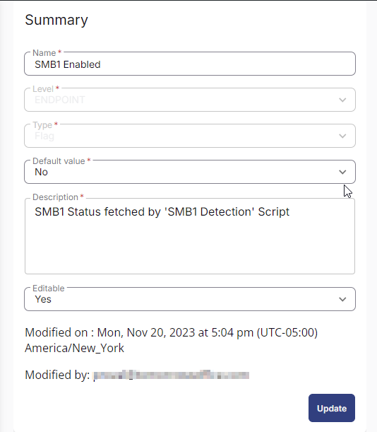
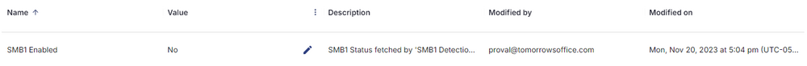

## Summary

This custom field is used to store and display the results of the task [CW RMM - Task - Detect SMB1](/docs/f5a58819-dcc7-4905-a3b5-52ff73751e21).

## Dependencies

[CW RMM - Task - Detect SMB1](/docs/f5a58819-dcc7-4905-a3b5-52ff73751e21)

## Details

| Field Name       | Type of Field (Machine or Organization) | Description                                 |
|------------------|-----------------------------------------|---------------------------------------------|
| SMB1 Enabled     | Endpoint                                | SMB1 Status fetched by 'Detect SMB1' Script |

## Screenshot

## Sample Value

