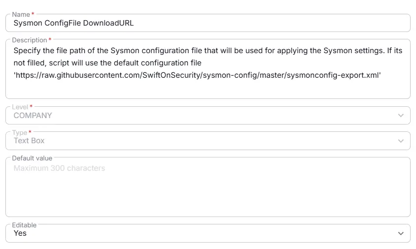

## Summary
Specify the file path of the Sysmon configuration file that will be used for applying the Sysmon settings. If its not filled, script will use the default configuration file:  
https://raw.githubusercontent.com/SwiftOnSecurity/sysmon-config/master/sysmonconfig-export.xml

## Dependencies

- [Solution - Sysmon Solution ](/docs/2db51f41-1313-46c4-81f1-8c67ed578b73) 

## Details

| Name                 | Level                | Type                | Default       |  Editable | Description                              |
|----------------------|----------------------|---------------------|------------------|----------|------------------------------------------|
| Sysmon ConfigFile DownloadURL | Company | Text Box |  | Yes  | Specify the file path of the Sysmon configuration file that will be used for applying the Sysmon settings. If its not filled, script will use the default configuration file 'https://raw.githubusercontent.com/SwiftOnSecurity/sysmon-config/master/sysmonconfig-export.xml' |

## Creation Process

### Step 1

Navigate to `Settings` ➞ `Custom Fields`  

### Step 2

Locate the `Add Field` button on the right-hand side of the screen and click on it.  

## Step 3

The `Add new custom field` dialog box will occur

## Completed Custom Field

## Changelog

### 2026-03-26

- Initial version of the document