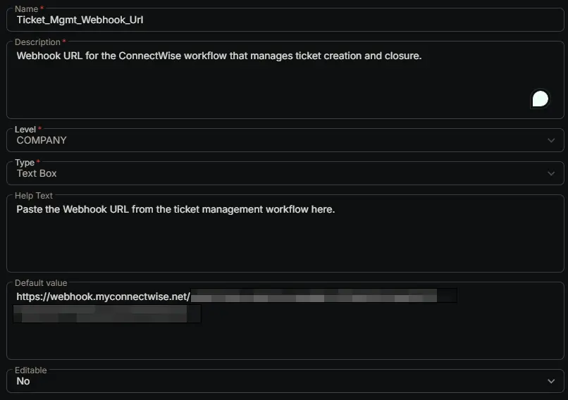

## Summary

Webhook URL for the [ConnectWise workflow](/docs/57daa951-2acc-4be7-a025-0d0ca729ef57) that manages ticket creation and closure.

## Dependencies

- [Triggers: CWRMM Ticket Management for Monitors](/docs/05c811e6-c6d0-4652-b4b6-2aa83f9605c7)
- [Workflow: CWRMM Ticket Management for Monitors](/docs/57daa951-2acc-4be7-a025-0d0ca729ef57)

## Custom Field Setup Location

**Custom Fields Path:** SETTINGS ➞ Custom Fields

## Details

| Name | Description | Level | Type | Help Text | Default Value | Editable |
|---|---|---|---|---|---|---|
| Ticket_Mgmt_Webhook_Url | Webhook URL for the ConnectWise workflow that manages ticket creation and closure. | `Company` | `Text Box` | Paste the Webhook URL from the ticket management workflow here. | `https://webhook.myconnectwise.net/...` | `No` |

**Set the workflow's webhook URL as this field's Default Value:**

This custom field is the **shared storage location** for the webhook URL generated by the [CWRMM Ticket Management for Monitors](/docs/57daa951-2acc-4be7-a025-0d0ca729ef57) workflow. That URL does **not** exist until you create a webhook instance inside the workflow's [trigger](/docs/05c811e6-c6d0-4652-b4b6-2aa83f9605c7), and because webhook instances are environment‑specific they **cannot be migrated** — so the value has to be typed in here by hand as part of the workflow setup.

When you finish [creating the webhook instance](/docs/57daa951-2acc-4be7-a025-0d0ca729ef57) (*Automation ➞ Workflows ➞ open the workflow ➞ click the Trigger node ➞ **New Webhook Instance +** ➞ copy the generated URL*), paste that URL into the **Default Value** of this custom field and **save** the field. The `https://webhook.myconnectwise.net/...` shown in the table above is only a **placeholder / example** — replace it with the real URL copied from your trigger instance.

The monitor scripts (Enhanced Drive Space, CPU, Memory, etc.) read this default value to discover where to POST their `Create` / `Close` / `Comment` payloads. That is exactly why the field is defined at the **Company** level with **Editable = No**: it represents a single, global webhook endpoint — not a per‑device value — and locking it stops anyone from accidentally overriding it on an individual record.

**If the Default Value is left blank or still set to the placeholder, the monitor scripts have no target to send to and alert ticketing will silently fail for every device.** After saving, always double‑check that the stored default value is an exact, character‑for‑character match of the URL shown in the workflow's trigger instance.

## Completed Custom Field

## Changelog

### 2026-06-24

- Initial version of the document
