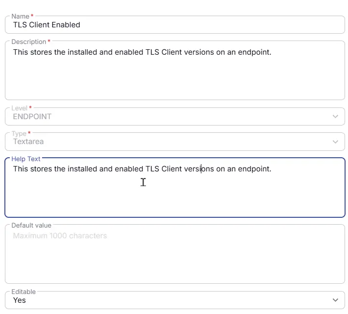

## Summary
This custom field stores the installed and enabled TLS Client versions on an endpoint.

## Details

| Name                 | Level                | Type                | Help Text | Default       | Editable | Description                              |
|----------------------|----------------------|---------------------|------------| ------|----------|------------------------------------------|
| TLS Client Enabled | Endpoint | TextArea |This stores the installed and enabled TLS Client versions on an endpoint. | - |  Yes  | This stores the installed and enabled TLS Client versions on an endpoint. |

## Dependencies

- [TLS Version Audit](/docs/7d261218-6e70-46c2-8d0f-a18bdcab3b07)  

## Completed Custom Field

## Changelog

### 2026-06-22

- Initial version of the document
