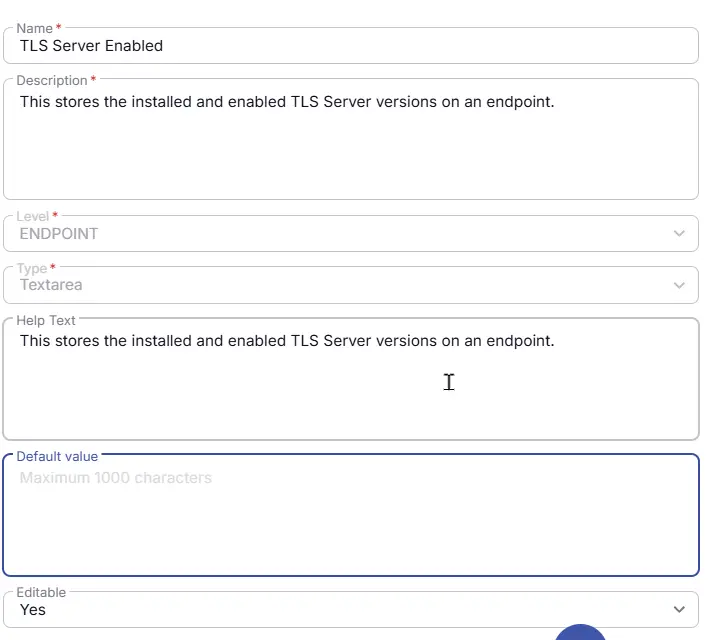

## Summary
This custom field stores the installed and enabled TLS Server versions on an endpoint.

## Details

| Name                 | Level                | Type                | Help Text | Default       | Editable | Description                              |
|----------------------|----------------------|---------------------|------------| ------|----------|------------------------------------------|
| TLS Server Enabled | Endpoint | TextArea | This stores the installed and enabled TLS Server versions on an endpoint. | - |  Yes  | This stores the installed and enabled TLS Server versions on an endpoint. |

## Creation Process

### Step 1

Navigate to `Settings` ➞ `Custom Fields`  

### Step 2

Locate the `Add Field` button on the right-hand side of the screen and click on it.  

## Step 3

The `Add new custom field` dialog box will occur

## Completed Custom Field

## Changelog

### 2026-06-18

- Initial version of the document
