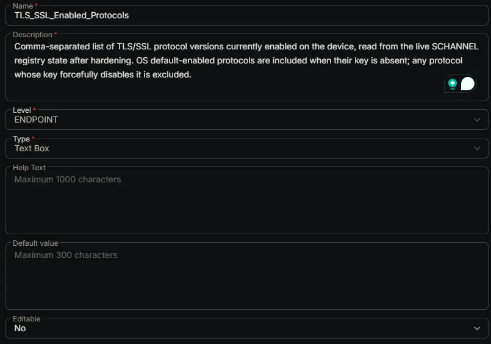

## Summary

Comma-separated list of TLS/SSL protocol versions currently enabled on the device, read from the live SCHANNEL registry state after hardening. OS default-enabled protocols are included when their key is absent; any protocol whose key forcefully disables it is excluded.

## Dependencies

- [Solution: TLS/SSL Security Hardening](/docs/13ac3912-863b-41fe-bb61-dfd681f06fa8)

## Custom Field Setup Location

**Custom Fields Path:** SETTINGS ➞ Custom Fields

## Details

| Name | Description | Level | Type | Option Type | Options | Help Text | Default Value | Editable |
|---|---|---|---|---|---|---|---|---|
| TLS_SSL_Enabled_Protocols | Comma-separated list of TLS/SSL protocol versions currently enabled on the device, read from the live SCHANNEL registry state after hardening. OS default-enabled protocols are included when their key is absent; any protocol whose key forcefully disables it is excluded. | `Endpoint` | `Text Box` | | | | | `No` |

## Completed Custom Field

## Changelog

### 2026-07-28

- Initial version of the document
