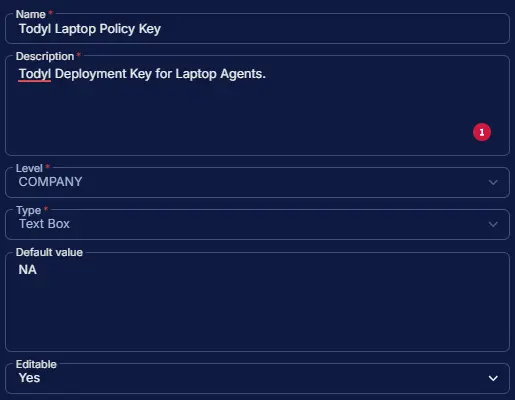

## Summary

Todyl Deployment Key for Laptop Agents.

## Dependencies

- [Deploy Todyl SGN Connect](/docs/e21d58b1-9fd5-4888-9e1f-788420313237)
- [Solution: Todyl SGN Connect Deployment](/docs/41308550-ea69-4cca-aa0d-9e6f02fcab43)

## Custom Field Setup Location

**Custom Fields Path:** `SETTINGS` ➞ `Custom Fields`  

## Details

| Name | Level | Type | Default Value | Editable | Description |
| ---- | ----- | ---- | ------------- | -------- | ----------- |
| Todyl Laptop Policy Key | COMPANY | Text Box | | Yes | Todyl Deployment Key for Laptop Agents. |

## Completed Custom Field

