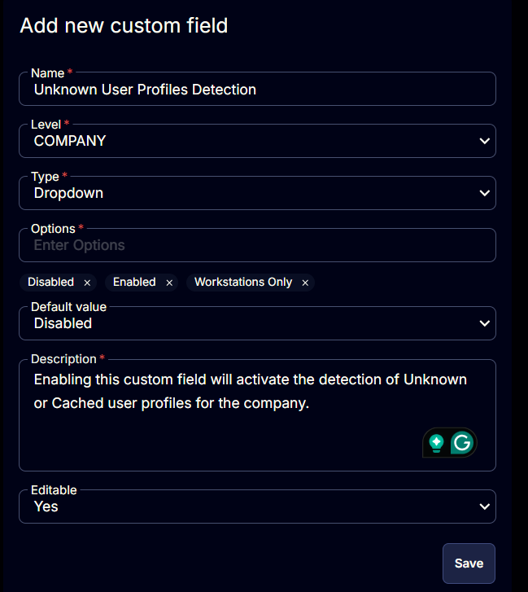

## Summary

Enabling this custom field will activate the detection of Unknown or Cached user profiles for the company.

## Details

| Field Name | Level | Type | Options |  Default Value | Description | Editable |
| ---------- | ----- | ---- | ------- | -------------- | ----------- | -------- |
| Unknown User Profile Detection | Company | Dropdown | <ul><li>Disabled</li><li>Enabled</li><li>Workstations Only</li></ul> | Disabled | Enabling this custom field will activate the detection of Unknown or Cached user profiles for the company. | Yes |

## Screenshots

