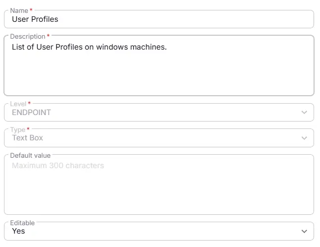

## Summary
This Custom Field lists the user Profiles on windows machines.

## Dependencies

- [Solution - Windows User Profiles](/docs/0ebb7e89-d2d8-40d4-ba1e-330ab20f86cd)

## Details

| Name                 | Level                | Type                | Default        | Required | Editable | Description                              |
|----------------------|----------------------|---------------------|------------------|----------|----------|------------------------------------------|
| User Profiles | Endpoint | Text | blank | False | Yes | List of User Profiles on windows machines.|

## Creation Process

### Step 1

Navigate to `Settings` ➞ `Custom Fields`  

### Step 2

Locate the `Add Field` button on the right-hand side of the screen and click on it.  

## Step 3

The `Add new custom field` dialog box will occur

## Completed Custom Field

## Changelog

### 2026-03-11

- Initial version of the document